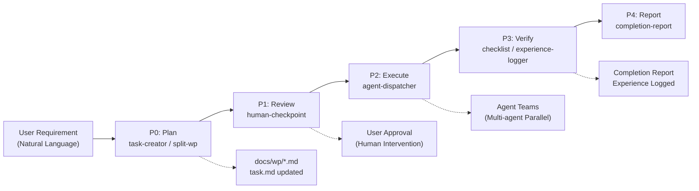

# Tackle Harness

> A plugin-based AI Agent workflow framework that provides task management, workflow orchestration, and role management for Claude Code

[](https://opensource.org/licenses/MIT)
[](https://github.com/ph419/tackle)

**[中文文档](README.md)**

## Why Tackle Harness

You describe what you need; Tackle Harness manages the entire process:

- **Plan first, human approval required** — AI outputs implementation plans and work package breakdowns, then waits for your confirmation before writing any code. No more "AI went rogue and changed a bunch of things."
- **Complex requirements, parallel delivery** — Large requirements are automatically split into independent modules, with multiple agents working simultaneously. Frontend, backend, and database changes progress in parallel — no serial waiting.
- **Experience accumulation, gets better over time** — After each task, lessons learned are automatically extracted. Next time a similar issue arises, agents reference historical experience for better decisions.

### End-to-End Data Flow

User requirements pass through five stages from planning to delivery:



## Installation

```bash
npm install tackle-harness
```

## Quick Start

```bash
# Navigate to your project directory
cd your-project

# One-command initialization (build skills + register hooks + create config directories)
npx tackle-harness init

# Or step by step
npx tackle-harness build      # Build skills to .claude/skills/, merge hooks into settings.json
npx tackle-harness validate   # Validate plugin integrity
```

## Use Cases

### Case 1: New Feature Development

**Your situation**: Adding a "Team Collaboration" module to a SaaS product, involving frontend UI, backend API, and database changes.

**Just say**:
```
Start workflow, implement team collaboration module, including:
- Team creation and management pages
- Member invitation and permission APIs
- Database table design
```

**What Tackle Harness does**:
1. Analyzes requirement complexity, splits into 4 work packages (frontend, backend, database, integration testing)
2. Outputs implementation plans for each work package, pauses for your review
3. After your approval, dispatches multiple agents to develop modules in parallel
4. Automatically runs code checks and test verification
5. Generates a completion report and asks for next steps

**Skills involved**: workflow-orchestrator → split-work-package → human-checkpoint → agent-dispatcher → checklist → completion-report

### Case 2: Batch Bug Fixes

**Your situation**: A backlog of 5 bugs before the sprint ends, want to handle them in parallel and wrap up quickly.

**Just say**:
```
Batch execute WP-015 through WP-019, fix these 5 bugs in parallel
```

**What Tackle Harness does**:
1. Analyzes dependencies between the 5 bugs (check for overlapping file changes)
2. Assigns conflict-free bugs to different agents for simultaneous fixes
3. Queues dependent bugs sequentially, auto-starting the next after each completes
4. Runs a checklist after all fixes to confirm no new issues introduced

**Skills involved**: agent-dispatcher → checklist → completion-report

### Case 3: System Refactoring

**Your situation**: Need to refactor a monolithic application into microservices, involving coordinated changes across multiple modules, worried about breaking things.

**Just say**:
```
Split work package, extract the user module from the monolith into an independent service
```

**What Tackle Harness does**:
1. Deep analysis of code structure, identifies all modules and dependencies that need changes
2. Generates a detailed refactoring plan (interface extraction, data migration, routing adjustments, etc.)
3. Pauses for your review of the architecture proposal (critical decision point)
4. Executes refactoring in dependency-ordered batches, auto-verifying after each batch
5. Records refactoring experience for future similar extraction tasks

**Skills involved**: split-work-package → human-checkpoint → agent-dispatcher → checklist → experience-logger → completion-report

## Command Reference

| Command | Description |
|---------|-------------|
| `npx tackle-harness` | Default: runs build |
| `npx tackle-harness build` | Build all skills, update .claude/settings.json |
| `npx tackle-harness validate` | Validate plugin format |
| `npx tackle-harness init` | First-time setup: build + create .claude/ directories |
| `npx tackle-harness --root <path>` | Specify target project path (default: current directory) |
| `npx tackle-harness --help` | Show help |

## Skills Reference

| Skill | Trigger (CN / EN) | Function |
|-------|---------|----------|
| task-creator | "创建任务" / "create task" | Create a single task in the task list |
| batch-task-creator | "批量创建任务" / "batch create tasks" | Batch create multiple tasks |
| split-work-package | "拆分工作包" / "split work package" | Split requirements into executable work packages |
| progress-tracker | "记录进度" / "record progress" | Track and report work progress |
| team-cleanup | "清理团队" / "cleanup team" | Release residual team resources |
| human-checkpoint | "等待审核" / "wait for review" | Pause and request human confirmation |
| role-manager | "查看角色" / "view roles" | Manage project role definitions |
| checklist | "运行检查" / "run checklist" | Execute checklists |
| completion-report | "完成报告" / "completion report" | Generate completion report |
| experience-logger | "总结经验" / "log experience" | Record project lessons learned |
| agent-dispatcher | "批量执行" / "dispatch agents" | Dispatch multiple sub-agents in parallel |
| workflow-orchestrator | "开始工作流" / "start workflow" | Orchestrate complete workflows |

## Workflow Overview

User requirements pass through 5 stages from planning to delivery:

```
Requirement → Plan(P0) → Review(P1) → Execute(P2) → Verify(P3) → Report(P4) → Delivery
```

| Stage | What Happens | Key Skills |
|-------|-------------|------------|
| **P0 Plan** | Parse requirements, split into work packages, write docs | task-creator, split-work-package |
| **P1 Review** | Pause for your plan approval (mandatory human intervention) | human-checkpoint |
| **P2 Execute** | Multi-agent parallel development, scheduled by dependencies | agent-dispatcher |
| **P3 Verify** | Code/test/doc quality verification, extract experience | checklist, experience-logger |
| **P4 Report** | Generate completion report, ask for next steps | completion-report |

> For the full data flow diagram and stage details, see [docs/ai_workflow.md](docs/ai_workflow.md)

## Plugin Architecture

Tackle Harness contains 4 plugin types, 19 plugins total:

| Type | Count | Purpose |
|------|-------|---------|
| Skill | 12 | Executable skills, directly callable by Claude Code |
| Provider | 3 | State store, role registry, memory store |
| Hook | 2 | Skill gate + session-start plan-mode rule injection |
| Validator | 2 | Document sync validation, work package validation |

> For plugin dependency graph and development guide, see [docs/plugin-development.md](docs/plugin-development.md)

## Build Output Structure

After running `tackle-harness build`, the following is generated in your project:

```
your-project/
  .claude/
    skills/                          # 12 skills
      skill-task-creator/skill.md
      skill-batch-task-creator/skill.md
      skill-split-work-package/skill.md
      skill-progress-tracker/skill.md
      skill-team-cleanup/skill.md
      skill-human-checkpoint/skill.md
      skill-role-manager/skill.md
      skill-checklist/skill.md
      skill-completion-report/skill.md
      skill-experience-logger/skill.md
      skill-agent-dispatcher/skill.md
      skill-workflow-orchestrator/skill.md
    hooks/                           # 2 hooks
      hook-skill-gate/index.js
      hook-session-start/index.js
    settings.json                    # Auto-registered hooks
```

## FAQ

### Skills not working after installation?

Make sure you ran `npx tackle-harness build` in your project root, and that `.claude/skills/` contains 12 skill folders.

### Can multiple projects share an installation?

Each project installs and builds independently. Different projects can use different versions.

### Global installation

```bash
npm install -g tackle-harness
tackle-harness build
```

After global installation, use the `tackle-harness` command directly without `npx`.

### How to uninstall?

```bash
npm uninstall tackle-harness
```

Skill files remain in `.claude/skills/`. Delete manually if needed.

### What are the hooks in settings.json?

`tackle-harness build` automatically injects three hooks into `.claude/settings.json`:
- `SessionStart` — On session startup, scans plan-mode skills and injects priority rules into system-reminder, ensuring task-creation skills enforce Plan mode
- `PreToolUse(Edit|Write)` — Blocks file edits under certain states
- `PostToolUse(Skill)` — Updates state after skill calls

These hooks point to scripts in `node_modules/tackle-harness/` and won't affect other configurations in your project. Existing settings.json content is preserved; only tackle-harness-related hooks are appended.

## Documentation

- [Configuration Reference](docs/config-reference.md) - Complete configuration file documentation
- [Best Practices](docs/best-practices.md) - Usage tips and optimization techniques
- [Plugin Development](docs/plugin-development.md) - Plugin architecture and development guide
- [Workflow Details](docs/ai_workflow.md) - Full workflow data flow and stage descriptions

## Contributing

Contributions welcome! We accept bug reports, feature suggestions, code submissions, and documentation improvements. See [Contributing Guide](CONTRIBUTING.md).

Quick start: Fork → Create branch → Make changes → Submit PR. Follow [Conventional Commits](https://www.conventionalcommits.org/) format.

## License

MIT License - See [LICENSE](LICENSE) file

## Acknowledgments

This project draws on excellent designs from the following open-source projects:
- DeerFlow - Memory extraction and middleware architecture
